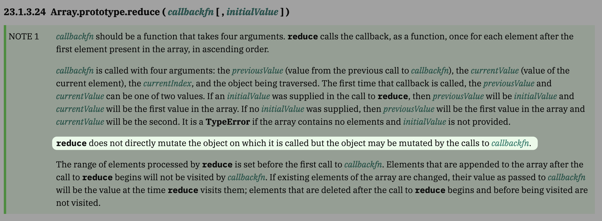

<h1><code>Array.prototype.reduce()`</code> mutations guide</h1>

### Contents
- [Abstract](#abstract)
- [Scenarios](#scenarios)
  - [Scenario 1 - Object constant](#scenario-1---object-constant)
  - [Scenario 2 - Nested object](#scenario-2---nested-object)
- [Solutions](#solutions)
  - [Solution 1 - Spreading the initial value](#solution-1---spreading-the-initial-value)
  - [Solution 2 - Not applying `.reduce()`](#solution-2---not-applying-reduce)
- [Examples](#examples)
  - [Launching the project](#launching-the-project)
  - [Examples provided](#examples-provided)
- [Issues](#issues)
- [Contributing](#contributing)

---

## Abstract

The ECMA standard describes mutations in reduce as follows [[tc39.es]](https://tc39.es/ecma262/#sec-array.prototype.reduce):



But we can face the case we have multiple reduces in the app or any other case when we would like to create a **separate variable** for reduce initial values.

This behavior in this scenario is **not** describes anywhere, so we can just pass the constant initial value and forget about it for some time.

> [!NOTE]
> It will work if we have only **one** `.reduce()` in an app with constant initial value provided.
> But when we create the second `.reduce()` before or after that one, problems appear.

---

## Scenarios

### Scenario 1 - Object constant

We have the global constant of on object:

```ts
const EMPTY_OBJECT = {};
```

Create some reduce and pass it as initial value:

```ts
import { EMPTY_OBJECT } from "@/constants";

const result = data.reduce((acc, item) => {
  // your code here
  // ...

  return acc;
}, EMPTY_OBJECT);
```

Lets see what happens in case of one reduce within app:

```zsh
"[firstReduceWithObjRef]: ----------------------------------------"]
[["[firstReduceWithObjRef]: ","start"]]
[["[firstReduceWithObjRef]: ","acc[0] ->",{}]]
[["[firstReduceWithObjRef]: ","acc[1] ->",{"1":1}]]
[["[firstReduceWithObjRef]: ","acc[2] ->",{"1":1,"2":1}]]
[["[firstReduceWithObjRef]: ","acc[3] ->",{"1":1,"2":1,"3":1}]]
[["[firstReduceWithObjRef]: ","acc[4] ->",{"1":1,"2":1,"3":1,"4":1}]]
[["[firstReduceWithObjRef]: ","acc[5] ->",{"1":1,"2":1,"3":1,"4":1,"5":1}]]
[["[firstReduceWithObjRef]: ","acc[6] ->",{"1":2,"2":1,"3":1,"4":1,"5":1}]]
[["[firstReduceWithObjRef]: ","acc[7] ->",{"1":2,"2":1,"3":1,"4":2,"5":1}]]
[["[firstReduceWithObjRef]: ","acc[8] ->",{"1":2,"2":2,"3":1,"4":2,"5":1}]]
[["[firstReduceWithObjRef]: ","acc[9] ->",{"1":2,"2":2,"3":1,"4":2,"5":1,"7":1}]]
[["[firstReduceWithObjRef]: ","finish ->",{"1":3,"2":2,"3":1,"4":2,"5":1,"7":1}]]
```

Everything is okay...

> [!IMPORTANT]
> UNTIL we add second reduce with same initial value:

Filling the first reduce result is the same:

```zsh
["[firstReduceWithObjRef]: ----------------------------------------"]
[["[firstReduceWithObjRef]: ","start"]]
[["[firstReduceWithObjRef]: ","acc[0] ->",{}]]
[["[firstReduceWithObjRef]: ","acc[1] ->",{"1":1}]]
[["[firstReduceWithObjRef]: ","acc[2] ->",{"1":1,"2":1}]]
[["[firstReduceWithObjRef]: ","acc[3] ->",{"1":1,"2":1,"3":1}]]
[["[firstReduceWithObjRef]: ","acc[4] ->",{"1":1,"2":1,"3":1,"4":1}]]
[["[firstReduceWithObjRef]: ","acc[5] ->",{"1":1,"2":1,"3":1,"4":1,"5":1}]]
[["[firstReduceWithObjRef]: ","acc[6] ->",{"1":2,"2":1,"3":1,"4":1,"5":1}]]
[["[firstReduceWithObjRef]: ","acc[7] ->",{"1":2,"2":1,"3":1,"4":2,"5":1}]]
[["[firstReduceWithObjRef]: ","acc[8] ->",{"1":2,"2":2,"3":1,"4":2,"5":1}]]
[["[firstReduceWithObjRef]: ","acc[9] ->",{"1":2,"2":2,"3":1,"4":2,"5":1,"7":1}]]
[["[firstReduceWithObjRef]: ","finish ->",{"1":3,"2":2,"3":1,"4":2,"5":1,"7":1}]]
```

But lets take a look at second reduce:

```zsh
["[secondReducerWithObjRef]: ----------------------------------------"]
[["[secondReducerWithObjRef]: ","start"]]
[["[secondReducerWithObjRef]: ","acc[0] ->",{"1":3,"2":2,"3":1,"4":2,"5":1,"7":1}]]
[["[secondReducerWithObjRef]: ","acc[1] ->",{"1":3,"2":2,"3":1,"4":2,"5":1,"7":1,"2-A":1}]]
[["[secondReducerWithObjRef]: ","acc[2] ->",{"1":3,"2":2,"3":1,"4":2,"5":1,"7":1,"2-A":1,"2-B":1}]]
[["[secondReducerWithObjRef]: ","acc[3] ->",{"1":3,"2":2,"3":1,"4":2,"5":1,"7":1,"2-A":1,"2-B":1,"2-C":1}]]
[["[secondReducerWithObjRef]: ","acc[4] ->",{"1":3,"2":2,"3":1,"4":2,"5":1,"7":1,"2-A":1,"2-B":1,"2-C":1,"2-D":1}]]
[["[secondReducerWithObjRef]: ","acc[5] ->",{"1":3,"2":2,"3":1,"4":2,"5":1,"7":1,"2-A":1,"2-B":1,"2-C":1,"2-D":1,"2-E":1}]]
[["[secondReducerWithObjRef]: ","acc[6] ->",{"1":3,"2":2,"3":1,"4":2,"5":1,"7":1,"2-A":2,"2-B":1,"2-C":1,"2-D":1,"2-E":1}]]
[["[secondReducerWithObjRef]: ","acc[7] ->",{"1":3,"2":2,"3":1,"4":2,"5":1,"7":1,"2-A":2,"2-B":1,"2-C":1,"2-D":2,"2-E":1}]]
[["[secondReducerWithObjRef]: ","acc[8] ->",{"1":3,"2":2,"3":1,"4":2,"5":1,"7":1,"2-A":2,"2-B":2,"2-C":1,"2-D":2,"2-E":1}]]
[["[secondReducerWithObjRef]: ","acc[9] ->",{"1":3,"2":2,"3":1,"4":2,"5":1,"7":1,"2-A":2,"2-B":2,"2-C":1,"2-D":2,"2-E":1,"2-G":1}]]
[["[secondReducerWithObjRef]: ","finish ->",{"1":3,"2":2,"3":1,"4":2,"5":1,"7":1,"2-A":3,"2-B":2,"2-C":1,"2-D":2,"2-E":1,"2-G":1}]]

["[main]: ----------------------------------------"]
[["[main]: ","firstReduceWithObjRef ->",{"1":3,"2":2,"3":1,"4":2,"5":1,"7":1,"2-A":3,"2-B":2,"2-C":1,"2-D":2,"2-E":1,"2-G":1}]]
[["[main]: ","secondReducerWithObjRef ->",{"1":3,"2":2,"3":1,"4":2,"5":1,"7":1,"2-A":3,"2-B":2,"2-C":1,"2-D":2,"2-E":1,"2-G":1}]]

```

> [!WARNING]
> Now we see some issues:
>
> - Second `reduce()` starts from result of the first one
> - Second `reduce()` keeps on filling as it has to be
> - When we get the values of both `reduce()` after completing both - we see equal values

That is because:

- `reduce()` accepts the **reference** to initial value without creating the copy of it
  - `acc` inside reduce becomes the reference to initialValue too.
    - every time we perform actions like `acc[key] = value` we mutate the initial value
  - global constant as initial value mutates for all the scope it applies for in every moment muttion are performing

> [!NOTE]
> Thus, we can get effect when our global constant `EMPTY_OBJECT` will never be empty again after these reduces. And it will be a lot of refactors in case of noticing this behavior.

### Scenario 2 - Nested object

If we have a nested object as a constant value - I have bad news for you.

> [!NOTE]
> Passing this constant to `reduce()` will mutate it in any way, no matter the solutions I will provide below...

Example of nested object:

```ts
export const NESTED_EMPTY_OBJECT = {
  fizz: EMPTY_OBJECT,
  buzz: EMPTY_OBJECT,
};

export const NESTED_EMPTY_OBJECT_SPREAD = {
  fizz: { ...EMPTY_OBJECT },
  buzz: { ...EMPTY_OBJECT },
};
```

---

## Solutions

### Solution 1 - Spreading the initial value

In case of one-level objects, like `EMPTY_OBJECT`, we can solve this issue by creating the copy of this constant as initial value for `.reduce()` like this:

```ts
import { EMPTY_OBJECT } from "@/constants";

const result = data.reduce(
  (acc, item) => {
    // your code here
    // ...

    return acc;
  },
  { ...EMPTY_OBJECT }
);
```

### Solution 2 - Not applying `.reduce()`

[MDN](https://developer.mozilla.org/en-US/docs/Web/JavaScript/Reference/Global_Objects/Array/reduce#when_to_not_use_reduce) provides some examples of ways we can prevent using `.reduce()` by creating the new instance of the object (spread or deep copy) and apply `.forEach()` loop or `for...of` syntax with mutating the copy.

❌ Incorrect by MDN:
```ts
const names = ["Alice", "Bob", "Tiff", "Bruce", "Alice"];
const countedNames = names.reduce((allNames, name) => {
  const currCount = allNames[name] ?? 0;
  allNames[name] = currCount + 1;
  // return allNames, otherwise the next iteration receives undefined
  return allNames;
}, Object.create(null));
```

✅ Correct by MDN:
```ts
const names = ["Alice", "Bob", "Tiff", "Bruce", "Alice"];
const countedNames = Object.create(null);
for (const name of names) {
  const currCount = countedNames[name] ?? 0;
  countedNames[name] = currCount + 1;
}
```

## Examples

I created this test application for demonstrating different behaviors of `.reduce()` with using different constant values

### Launching the project

1. Clone or fork
2. run `pnpm install`
3. run `pnpm dev`
4. navigate to `http://127.0.0.1:5173/`

> [!TIP]
> You can switch the examples by clicking relevant button and logs will be displayed in 2 places:
> - DevTools console
> - Bottom part of viewport

### Examples provided

- Plain object
  - object reference
  - the spread copy
- Nested object
  - object reference
  - the spread copy
  - the spread copy with spread copies of nested objects


## Issues

In case of comments or issues - you are welcome!!!

## Contributing

If you have more examples of such behavior or others have smth to do with `.reduce()`, you are welcome as well!!!